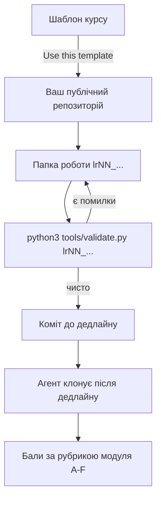

# Портфель проєкту

Стартовий шаблон репозиторію курсу «Управління ІТ проєктами», 2026.
Версія схеми артефактів: **1.18.0** (звіряється з `tools/SCHEMAS.md` курсу).

## Картка студента

Заповнюється на ЛР1 і оновлюється, якщо щось змінилось.

| Поле | Значення |
| --- | --- |
| Прізвище та ім'я | |
| GitHub-логін | |
| Підгрупа | КН-41 або КН-42 |
| Тема проєкту | |
| Варіант вхідних умов | номер із таблиці варіантів курсу |
| Трекер | посилання |
| Дошка | посилання |
| Валюта проєкту | для кошторису ЛР16 |
| Contingency, % | від прямих витрат, ЛР16 |

## Як влаштований репозиторій

Одна папка на роботу, назва папки фіксована. Табличні артефакти лежать як CSV
поруч із поясненням у Markdown: CSV перевіряється програмно, Markdown читає
людина. Порожні CSV у шаблоні вже мають правильний рядок заголовків, міняти
імена колонок не можна.

```
lr01_case/               розтин провалу реального проєкту
lr02_approach/           approach.csv + decision.csv, вибір підходу для трьох проєктів
lr03_sprint_simulation/  журнал спринта ЛР3
lr04_kanban/             ваша дошка: DoW, WIP-ліміти, дати карток для ЛР14
lr05_charter/            статут + success_criteria.csv + stakeholders.csv
lr06_backlog/            backlog.csv + dor.md, беклог і Definition of Ready
lr07_wbs/                wbs.csv + schedule.csv + roadmap.csv
lr08_poker/              votes.csv + estimates.csv, оцінки беклогу
lr09_forecast/           velocity.csv + forecast.csv
lr10_review/             review.md на чужий портфель + README.md з реакцією
lr11_risks_quality/      risks.csv + techdebt.csv + changelog.csv + dod.md
lr12_communication/      raci.csv + communication.csv
lr13_roleplay/           діалоги зі стейкхолдерами
lr14_metrics/            flow.csv + аналіз
lr15_status_report/      статус-звіт + change_request.md
lr16_budget/             rate_card.csv + budget.csv + plan_fact.csv
lr17_ai_assistant/       автоматизація і розбір помилок інструмента
lr18_closure/            closure_report.md до 23:59 дня пари ЛР19
```

Здається все, порожніх папок у шаблоні немає. Бали ставляться не за окремі
роботи, а за десять модулів проєкту: кожен модуль це кілька робіт, зшитих
рубрикою з шести блоків. Які роботи в який модуль входять, написано в умові
проєкту.

Роботи без балів не безкоштовні: без журналу спринта нема з чим іти в ЛР4, без
дат із дошки нема що аналізувати на ЛР14, без оцінок нема на чому будувати
прогноз ЛР9.

## Як здавати

Один цикл на всі роботи:



Здача це коміт у папку роботи до дедлайну свого пакета. Дедлайнів три, вони
задані в правилах курсу (`course_rules.md` у папці курсу на Drive) і прив'язані
до дат пар ЛР6, ЛР11 і ЛР17 плюс сім днів.
Дата здачі береться з git, тому окремо нічого надсилати не треба:

```bash
git log -1 --format=%cI -- lr06_backlog
```

Посилання на Google Docs, скриншоти в месенджерах і архіви не приймаються.
Скриншот трекера або дошки можна покласти в папку як ілюстрацію, але предметом
перевірки є файл.

Замість скриншота краще малювати схему в mermaid прямо в `README.md` роботи:
GitHub її показує, вона лежить у git текстом, її видно в diff і вона не
протухає після зміни дошки. На бал це не впливає, предметом перевірки лишається
CSV, але карта стейкхолдерів, WBS або потік задачі в такому вигляді читаються
краще за картинку.

Умови робіт, шаблони звітів і еталонні дані лежать у публічному репозиторії
курсу, посилання дає викладач на ЛР1. У вашому репозиторії поруч лежить копія
спеки артефактів: `tools/SCHEMAS.md` описує кожну колонку кожного CSV, а
`tools/schemas.json` це та сама спека для валідатора.

Перед здачею проженіть валідатор курсу і виправте зауваження:

```bash
python3 tools/validate.py              # весь портфель
python3 tools/validate.py lr06_backlog # тільки одна папка
```

Якщо валідатор скаржиться правилом `X-6`, спека курсу оновилась: візьміть
свіжу копію папки `tools/` із шаблону курсу і поставте нову версію в рядок
«Версія схеми артефактів» вище. Це не помилка вашої роботи, це синхронізація.

Буває, що оновлення спеки додає колонку в CSV, який ви вже заповнили. Тоді
валідатор скаже, що склад колонок не збігається зі спекою. Порядок дій такий:
допишіть нову колонку в рядок заголовків у тому місці, де вона стоїть у
`tools/SCHEMAS.md`, поставте в наявних рядках порожнє значення і заповніть його
там, де воно потрібне за правилами. Свої дані при цьому не переносяться і не
перенумеровуються: ID історій і робіт фіксовані до кінця семестру.

Валідатор перевіряє механіку: наявність файлів, склад колонок, словники
значень, внутрішні правила (рівно одна A в кожному рядку RACI, score дорівнює
добутку ймовірності на вплив, суми в кошторисі) і наскрізні зв'язки між
файлами. Помилки рівня «помилка» треба виправити, «попередження» лишається на
ваш розсуд і може стати темою розмови на перевірці. Порожній CSV із одним
рядком заголовків це попередження, а не помилка: роботу ще не починали.

## Наскрізна консистентність

Карта залежностей портфеля намальована у `tools/SCHEMAS.md`, розділ «Карта
залежностей портфеля»: там видно, який файл чим годує решту семестру.

Ключі історій із `backlog.csv` живуть далі в оцінках, прогнозі, релізах,
ризиках і потоці задач. Оцінки з покеру мають збігатися з тими, що пішли в
Monte Carlo і в кошторис. Одне число має одне місце: оцінка тільки в
`estimates.csv`, дати і статус тільки у `flow.csv`.

## Мова і дані

Артефакти українською. Технічні терміни не перекладаємо силоміць. Репозиторій
публічний, тому персональних даних третіх осіб в артефактах бути не повинно:
замовники ваших тем це рольові персонажі, а не конкретні працівники академії.
