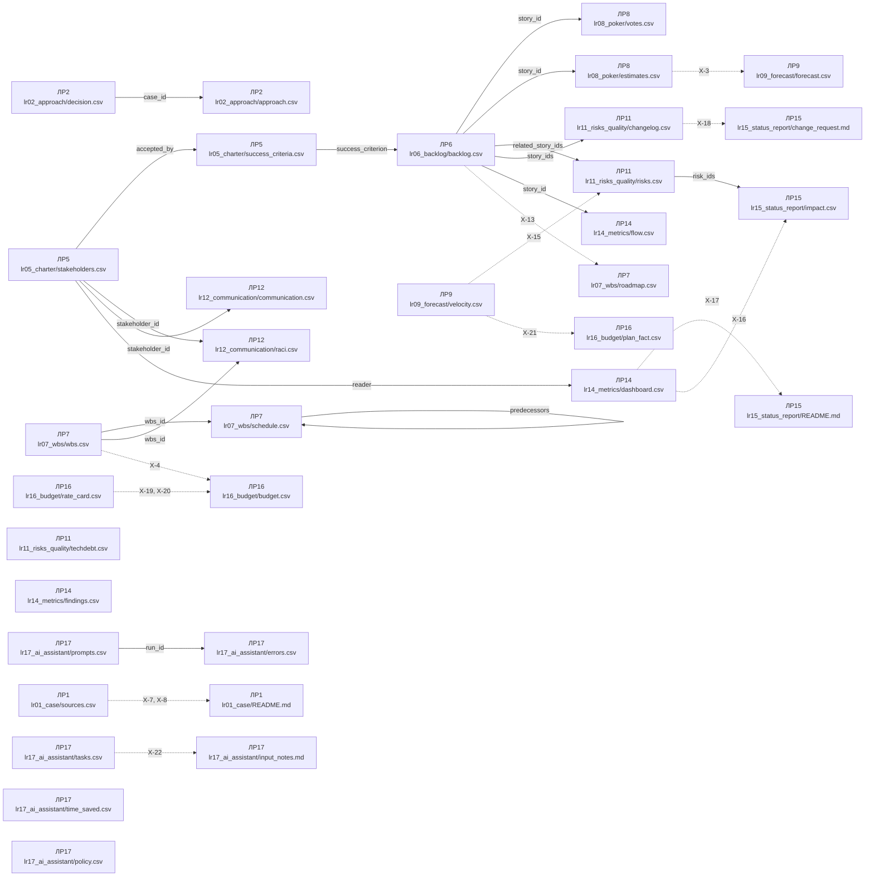

# Схеми артефактів курсу «Управління ІТ проєктами»

Згенеровано з `tools/schemas.json`, версія схеми **1.18.0**, оновлено 2026-09-09.

Файл не редагується руками: правиться спека, далі запускається
`python3 tools/generate_schema_docs.py`.


## Загальні конвенції

| Правило | Значення |
| --- | --- |
| `encoding` | utf-8 |
| `delimiter` | , |
| `decimal_separator` | . |
| `date_format` | YYYY-MM-DD |
| `list_separator` | ; |
| `header_language` | англійська, імена колонок точно як у спеці |
| `value_language` | українська |
| `empty_value` | порожня клітинка, не прочерк і не n/a |
| `no_total_rows` | рядків «Разом» у CSV немає, суми рахує валідатор |
| `no_merged_cells` | одна сутність це один рядок, об'єднаних клітинок немає |
| `single_source` | одне число має одне місце: оцінка тільки в estimates.csv, дати і статус тільки у flow.csv, беклог їх не дублює |
| `stable_ids` | ID фіксуються при створенні і не перенумеровуються до кінця семестру |

Формати ключів: `story_id` як `S-01`, `stakeholder_id` як `ST-01`, `wbs_id` як `1.2.3`, `release_id` як `REL-1`, `flow_item_id` як `F-001`, `finding_id` як `FN-01`, `dashboard_metric_id` як `MT-01`, `risk_id` як `R-01`, `debt_id` як `D-01`, `change_id` як `CH-01`, `activity_id` як `A-01`, `communication_id` як `C-01`, `budget_line_id` як `B-01`, `source_id` як `SRC-01`, `task_id` як `T-01`, `criterion_id` як `SC-01`, `ai_item_id` як `AT-01`, `prompt_run_id` як `P-01`, `ai_error_id` як `ER-01`, `time_case_id` як `TS-01`, `ai_rule_id` як `PL-01`.


## Словники значень

- `ai_error_type`: `fabrication`, `omission`, `overconfidence`, `other`
- `ai_mode`: `autonomous`, `draft`, `forbidden`
- `approach`: `predictive`, `adaptive`, `hybrid`
- `attitude`: `supporter`, `neutral`, `blocker`
- `budget_category`: `labor`, `tools`, `infrastructure`, `other`, `contingency`, `management_reserve`
- `change_decision`: `accepted`, `rejected`, `deferred`
- `change_source`: `course_event`, `customer`, `own_decision`, `external`
- `channel`: `email`, `meeting`, `chat`, `report`, `demo`, `call`
- `comm_format`: `written`, `verbal`, `dashboard`, `presentation`
- `criterion`: `requirements`, `technology`, `release_cost`, `customer`, `contract`, `team`
- `debt_decision`: `pay_now`, `pay_later`, `accept`
- `debt_impact`: `low`, `medium`, `high`
- `debt_type`: `deliberate_prudent`, `deliberate_reckless`, `inadvertent_prudent`, `inadvertent_reckless`
- `final_points`: `0`, `1`, `2`, `3`, `5`, `8`, `13`, `21`
- `flow_type`: `feature`, `bug`, `tech_debt`, `other`
- `frequency`: `daily`, `weekly`, `biweekly`, `monthly`, `on_event`
- `impact_dimension`: `scope`, `schedule`, `budget`, `quality`, `risk`
- `influence`: `low`, `high`
- `interest`: `low`, `high`
- `item_origin`: `mine`, `ai`, `both`
- `lr02_case`: `C-1`, `C-2`, `C-3`
- `moscow_class`: `must`, `should`, `could`, `wont`
- `note_item_type`: `task`, `decision`, `open_question`
- `priority_method`: `moscow`, `rice`, `wsjf`
- `prompt_result`: `used`, `used_with_edits`, `rejected`
- `pull`: `predictive`, `adaptive`, `neutral`
- `raci_role`: `R`, `A`, `AR`, `C`, `I`
- `reference_dataset`: `burndown`, `cfd`, `dora`
- `risk_category`: `technical`, `external`, `organizational`, `project_management`
- `risk_status`: `open`, `closed`, `realized`
- `risk_strategy`: `avoid`, `mitigate`, `transfer`, `accept`, `escalate`
- `stakeholder_strategy`: `manage_closely`, `keep_satisfied`, `keep_informed`, `monitor`
- `story_points`: `0`, `1`, `2`, `3`, `5`, `8`, `13`, `21`, `?`
- `time_basis`: `measured`, `estimated`
- `yes_no`: `yes`, `no`

## Файли

| Робота | Файл | Ключ | Мінімум рядків |
| :-: | --- | --- | :-: |
| ЛР1 | `lr01_case/sources.csv` | `source_id` | 3 |
| ЛР2 | `lr02_approach/approach.csv` | `case_id + criterion` | 18 |
| ЛР2 | `lr02_approach/decision.csv` | `case_id` | 3 |
| ЛР5 | `lr05_charter/stakeholders.csv` | `stakeholder_id` | 5 |
| ЛР5 | `lr05_charter/success_criteria.csv` | `criterion_id` | 3 |
| ЛР6 | `lr06_backlog/backlog.csv` | `story_id` | 15 |
| ЛР7 | `lr07_wbs/wbs.csv` | `wbs_id` | 12 |
| ЛР7 | `lr07_wbs/schedule.csv` | `task_id` | 10 |
| ЛР7 | `lr07_wbs/roadmap.csv` | `release_id` | 2 |
| ЛР8 | `lr08_poker/votes.csv` | `story_id + round + voter` | 24 |
| ЛР8 | `lr08_poker/estimates.csv` | `story_id` | 8 |
| ЛР9 | `lr09_forecast/velocity.csv` | `sprint` | 2 |
| ЛР9 | `lr09_forecast/forecast.csv` | `scenario` | 1 |
| ЛР11 | `lr11_risks_quality/risks.csv` | `risk_id` | 6 |
| ЛР11 | `lr11_risks_quality/techdebt.csv` | `debt_id` | 3 |
| ЛР11 | `lr11_risks_quality/changelog.csv` | `change_id` | 1 |
| ЛР12 | `lr12_communication/raci.csv` | `activity_id + stakeholder_id` | 18 |
| ЛР12 | `lr12_communication/communication.csv` | `item_id` | 5 |
| ЛР14 | `lr14_metrics/flow.csv` | `item_id` | 12 |
| ЛР14 | `lr14_metrics/findings.csv` | `finding_id` | 6 |
| ЛР14 | `lr14_metrics/dashboard.csv` | `metric_id` | 3 |
| ЛР15 | `lr15_status_report/impact.csv` | `dimension` | 5 |
| ЛР16 | `lr16_budget/rate_card.csv` | `role` | 3 |
| ЛР16 | `lr16_budget/budget.csv` | `line_id` | 6 |
| ЛР16 | `lr16_budget/plan_fact.csv` | `sprint` | 2 |
| ЛР17 | `lr17_ai_assistant/tasks.csv` | `item_id` | 8 |
| ЛР17 | `lr17_ai_assistant/prompts.csv` | `run_id` | 4 |
| ЛР17 | `lr17_ai_assistant/errors.csv` | `error_id` | 3 |
| ЛР17 | `lr17_ai_assistant/time_saved.csv` | `case_id` | 3 |
| ЛР17 | `lr17_ai_assistant/policy.csv` | `rule_id` | 5 |

## Карта залежностей портфеля

Що з чого росте. Суцільна стрілка означає, що ключі одного файла живуть
у другому, пунктирна означає наскрізне правило звірки чисел. Схема
будується з цієї ж спеки, тому вона завжди відповідає колонкам вище.



Файли без стрілок теж обов'язкові: вони просто не мають спільних
ключів з іншими роботами.


### Джерела розтину кейсу, `lr01_case/sources.csv`

Робота ЛР1. Ключ: `source_id`. Мінімум рядків: 3.

| Колонка | Тип | Обов'язкова | Обмеження | Опис |
| --- | --- | :-: | --- | --- |
| `source_id` | ідентифікатор | так | формат `^SRC-\d{2}$`; унікальне | Ключ джерела, у тексті розтину ставиться як [SRC-01] |
| `claim` | текст | так |  | Твердження або подія розтину, які спираються на це джерело |
| `source_title` | текст | так |  | Назва документа так, як вона написана в самому документі |
| `publisher` | текст | так |  | Установа або видання, яке випустило документ |
| `url` | текст | так | формат `^https?://\S+$` | Пряме посилання на документ, не на головну сторінку сайту |
| `pub_date` | дата | так |  | Дата публікації документа |
| `accessed` | дата | так |  | Дата, коли ви відкривали документ |

Рядок заголовків:

```
source_id,claim,source_title,publisher,url,pub_date,accessed
```

Правила файла:

- `SRC-1` (error): Різних значень publisher щонайменше два: одна установа це одна точка зору
- `SRC-2` (error): Різних значень url щонайменше три: три рядки на один документ це одне джерело
- `SRC-3` (error): Щонайменше одне джерело поза доменом wikipedia.org
- `SRC-4` (warning): Дата accessed не раніша за pub_date

### Матриця критеріїв вибору підходу, `lr02_approach/approach.csv`

Робота ЛР2. Ключ: `case_id + criterion`. Мінімум рядків: 18.

| Колонка | Тип | Обов'язкова | Обмеження | Опис |
| --- | --- | :-: | --- | --- |
| `case_id` | значення зі словника | так | одне з: `C-1`, `C-2`, `C-3`; посилання на `lr02_approach/decision.csv:case_id` | Кейс курсу, описаний у роздатковому матеріалі ЛР2 |
| `criterion` | значення зі словника | так | одне з: `requirements`, `technology`, `release_cost`, `customer`, `contract`, `team` | Критерій вибору з таблиці лекції L2, шість штук на кожен кейс |
| `pull` | значення зі словника | так | одне з: `predictive`, `adaptive`, `neutral` | Куди цей критерій тягне саме в цьому кейсі |
| `argument` | текст | так |  | Факт з опису кейсу, через який критерій тягне саме туди, одним рядком |

Рядок заголовків:

```
case_id,criterion,pull,argument
```

Правила файла:

- `AP-1` (error): Пара case_id і criterion унікальна: один критерій оцінюється в кейсі один раз
- `AP-2` (error): У кожного case_id рівно шість рядків, по одному на кожен критерій зі словника
- `AP-3` (warning): Аргумент довший за 40 символів: переказ назви критерію аргументом не є
- `AP-4` (warning): У кожного кейсу щонайменше два різні значення pull: шість однакових стрілок означають, що кейс не читали
- `AP-5` (warning): Рядків зі значенням pull neutral не більше двох з вісімнадцяти: neutral це відсутність тяги, а не спосіб не вирішувати

### Рішення по кейсах ЛР2, `lr02_approach/decision.csv`

Робота ЛР2. Ключ: `case_id`. Мінімум рядків: 3.

| Колонка | Тип | Обов'язкова | Обмеження | Опис |
| --- | --- | :-: | --- | --- |
| `case_id` | значення зі словника | так | одне з: `C-1`, `C-2`, `C-3`; унікальне | Кейс курсу, один рядок на кейс |
| `chosen_approach` | значення зі словника | так | одне з: `predictive`, `adaptive`, `hybrid` | Обраний підхід до цього кейсу |
| `main_conflict` | значення зі словника | так | одне з: `requirements`, `technology`, `release_cost`, `customer`, `contract`, `team` | Критерій, який тягне проти обраного підходу і ціну якого ви платите свідомо |
| `contract_impact` | текст | так |  | Що зміниться у виборі, якщо змінити контрактну модель кейсу |
| `first_step` | текст | так |  | Перша дія PM у перший тиждень такого проєкту |

Рядок заголовків:

```
case_id,chosen_approach,main_conflict,contract_impact,first_step
```

Правила файла:

- `DC-1` (error): У файлі присутні всі три кейси курсу: C-1, C-2 і C-3
- `DC-2` (warning): contract_impact і first_step довші за 40 символів і не повторюють назву підходу
- `DC-3` (warning): Різних значень chosen_approach щонайменше два: три однакові відповіді на три різні кейси це привід до розмови

### Карта стейкхолдерів, `lr05_charter/stakeholders.csv`

Робота ЛР5. Ключ: `stakeholder_id`. Мінімум рядків: 5.

| Колонка | Тип | Обов'язкова | Обмеження | Опис |
| --- | --- | :-: | --- | --- |
| `stakeholder_id` | ідентифікатор | так | формат `^ST-\d{2}$`; унікальне | Ключ стейкхолдера, живе далі в RACI і плані комунікацій |
| `name_or_role` | текст | так |  | Роль або умовне ім'я персонажа, не реальна людина |
| `organization` | текст | ні |  | Сторона, яку представляє |
| `interest` | значення зі словника | так | одне з: `low`, `high` | Інтерес до проєкту за матрицею |
| `influence` | значення зі словника | так | одне з: `low`, `high` | Вплив на проєкт за матрицею |
| `attitude` | значення зі словника | так | одне з: `supporter`, `neutral`, `blocker` | Ставлення до проєкту |
| `strategy` | значення зі словника | так | одне з: `manage_closely`, `keep_satisfied`, `keep_informed`, `monitor` | Стратегія роботи, має відповідати квадранту |
| `owner` | текст | так |  | Хто веде ці відносини з вашого боку: ви або роль зі складу вашого варіанта |

Рядок заголовків:

```
stakeholder_id,name_or_role,organization,interest,influence,attitude,strategy,owner
```

Правила файла:

- `ST-1` (error): Стратегія відповідає квадранту: high/high це manage_closely, низький інтерес і високий вплив це keep_satisfied, високий інтерес і низький вплив це keep_informed, low/low це monitor
- `ST-2` (error): Щонайменше один стейкхолдер має стратегію manage_closely
- `ST-3` (error): Щонайменше один стейкхолдер має attitude, відмінне від supporter: проєкт, який нікому не заважає, зазвичай нікому й не потрібен

### Критерії успіху проєкту, `lr05_charter/success_criteria.csv`

Робота ЛР5. Ключ: `criterion_id`. Мінімум рядків: 3.

| Колонка | Тип | Обов'язкова | Обмеження | Опис |
| --- | --- | :-: | --- | --- |
| `criterion_id` | ідентифікатор | так | формат `^SC-\d{2}$`; унікальне | Ключ критерію, живе далі в беклозі і в звіті про закриття |
| `criterion` | текст | так |  | Що саме вважається успіхом, одна фраза без слова «зручний» |
| `metric` | текст | так |  | Що міряємо: величина, а не побажання |
| `baseline` | текст | ні |  | Як зараз, до проєкту. Порожньо, якщо міряти нічого |
| `target` | текст | так |  | Цільове значення з числом і одиницею |
| `measure_how` | текст | так |  | Звідки беруться дані і коли вимірюємо |
| `accepted_by` | ідентифікатор | так | посилання на `lr05_charter/stakeholders.csv:stakeholder_id` | Стейкхолдер, який приймає цей критерій |

Рядок заголовків:

```
criterion_id,criterion,metric,baseline,target,measure_how,accepted_by
```

Правила файла:

- `SC-1` (error): У target є число: критерій без числа не приймається жодною стороною
- `SC-2` (error): measure_how не повторює target і називає джерело даних або момент виміру
- `SC-3` (error): Різних значень accepted_by щонайменше два: якщо всі критерії приймає одна людина, карта стейкхолдерів у статуті не працює

### Беклог продукту, `lr06_backlog/backlog.csv`

Робота ЛР6. Ключ: `story_id`. Мінімум рядків: 15.

| Колонка | Тип | Обов'язкова | Обмеження | Опис |
| --- | --- | :-: | --- | --- |
| `story_id` | ідентифікатор | так | формат `^S-\d{2}$`; унікальне | Наскрізний ключ історії на весь семестр |
| `epic` | текст | так |  | Епік, до якого належить історія |
| `title` | текст | так |  | Коротка назва історії |
| `as_a` | текст | так |  | Роль користувача |
| `i_want` | текст | так |  | Що хоче зробити |
| `so_that` | текст | так |  | Яку цінність отримує |
| `acceptance_criteria` | текст | ні | список через `;`, щонайменше 2 елементи | Критерії приймання через крапку з комою, кожен перевірюваний, щонайменше два. Обов'язкові для історій першого релізу, у далеких історіях лишаються порожніми свідомо |
| `priority_method` | значення зі словника | так | одне з: `moscow`, `rice`, `wsjf` | Метод пріоритезації, однаковий для всього беклогу |
| `priority_score` | текст | так |  | Значення методу: клас MoSCoW або число RICE чи WSJF |
| `priority_inputs` | текст | ні | список через `;` | Складники методу через крапку з комою у вигляді ключ=число: reach=400;impact=2;confidence=0.8;effort=1.5 для RICE, business_value=8;time_criticality=5;risk_reduction=3;job_size=3 для WSJF. Обов'язкові для історій першого релізу, для решти достатньо бала. Для MoSCoW порожньо |
| `rank` | ціле число | так | унікальне; не менше 1 | Місце в черзі, суцільна нумерація від 1 |
| `release` | ідентифікатор | ні | формат `^REL-\d{1,2}$` | Реліз, у який історія запланована. Порожньо, якщо історія ще чекає черги. Джерело правди складу релізу: roadmap.csv його не дублює |
| `success_criterion` | ідентифікатор | ні | посилання на `lr05_charter/success_criteria.csv:criterion_id` | Критерій успіху зі статуту, на який працює історія. Обов'язковий для історій першого релізу |

Рядок заголовків:

```
story_id,epic,title,as_a,i_want,so_that,acceptance_criteria,priority_method,priority_score,priority_inputs,rank,release,success_criterion
```

Правила файла:

- `BL-1` (error): Значення rank утворюють суцільний ряд від 1 до кількості історій без пропусків
- `BL-2` (error): Один priority_method на весь файл
- `BL-3` (error): У кожної історії з release REL-1 заповнені acceptance_criteria
- `BL-4` (error): У перший реліз REL-1 включені щонайменше вісім історій
- `BL-5` (error): У кожної історії з release REL-1 заповнений success_criterion
- `BL-6` (error): Для методів rice і wsjf priority_inputs заповнений у кожної історії першого релізу, і скрізь, де він заповнений, priority_score дорівнює результату формули з похибкою до 0.1
- `BL-7` (error): Для методу moscow priority_score це must, should, could або wont, і історія з класом wont не входить у перший реліз
- `BL-8` (warning): Жодна історія поза першим релізом не стоїть у черзі вище за історію першого релізу
- `BL-9` (warning): Для методу moscow частка must серед історій першого релізу не перевищує 60 відсотків
- `BL-10` (error): Різних епіків у беклозі щонайменше три
- `BL-11` (warning): Жодна історія першого релізу не має final_estimate 21 в estimates.csv: історія на цілий спринт це епік

### WBS проєкту, `lr07_wbs/wbs.csv`

Робота ЛР7. Ключ: `wbs_id`. Мінімум рядків: 12.

| Колонка | Тип | Обов'язкова | Обмеження | Опис |
| --- | --- | :-: | --- | --- |
| `wbs_id` | ідентифікатор | так | формат `^\d+(\.\d+)*$`; унікальне | Ієрархічний номер вузла |
| `parent_id` | ідентифікатор | ні |  | Батьківський вузол, порожньо тільки у кореня |
| `name` | текст | так |  | Назва пакета робіт |
| `level` | ціле число | так | не менше 1 | Рівень вкладеності, дорівнює кількості сегментів wbs_id |
| `deliverable` | текст | так |  | Що є результатом вузла, іменник, не дієслово |
| `owner` | текст | так |  | Відповідальний за пакет |
| `estimate_hours` | число | так | не менше 0 | Оцінка в годинах |

Рядок заголовків:

```
wbs_id,parent_id,name,level,deliverable,owner,estimate_hours
```

Правила файла:

- `WBS-1` (error): level дорівнює кількості сегментів у wbs_id
- `WBS-2` (error): parent_id існує у файлі і є префіксом wbs_id
- `WBS-3` (error): Правило 100%: estimate_hours нелистового вузла дорівнює сумі дітей
- `WBS-4` (warning): У WBS присутні пакети управління, тестування і розгортання: типова забута робота

### Календарний план проєкту, `lr07_wbs/schedule.csv`

Робота ЛР7. Ключ: `task_id`. Мінімум рядків: 10.

| Колонка | Тип | Обов'язкова | Обмеження | Опис |
| --- | --- | :-: | --- | --- |
| `task_id` | ідентифікатор | так | формат `^T-\d{2}$`; унікальне | Ключ роботи календарного плану |
| `wbs_id` | ідентифікатор | так | посилання на `lr07_wbs/wbs.csv:wbs_id` | Листовий вузол WBS, до якого належить робота |
| `name` | текст | так |  | Назва роботи або віхи |
| `duration_days` | ціле число | так | не менше 0 | Тривалість у робочих днях; у віхи 0 |
| `predecessors` | список ідентифікаторів | ні | формат `^T-\d{2}$`; посилання на `lr07_wbs/schedule.csv:task_id` | Попередники через крапку з комою, зв'язок finish to start; порожньо у стартових робіт |
| `milestone` | значення зі словника | так | одне з: `yes`, `no` | Чи є рядок віхою |
| `float_days` | ціле число | так | не менше 0 | Повний резерв роботи в днях, порахований студентом |
| `is_critical` | значення зі словника | так | одне з: `yes`, `no` | Чи лежить робота на критичному шляху |

Рядок заголовків:

```
task_id,wbs_id,name,duration_days,predecessors,milestone,float_days,is_critical
```

Правила файла:

- `SCH-1` (error): У графі залежностей немає циклів: робота не може бути власним попередником навіть через ланцюг
- `SCH-2` (error): float_days дорівнює повному резерву, порахованому за тривалостями і залежностями
- `SCH-3` (error): is_critical дорівнює yes рівно в тих робіт, чий повний резерв нульовий
- `SCH-4` (warning): У плані щонайменше дві віхи: без контрольних точок графік не має чим міряти рух
- `SCH-5` (warning): Віха має нульову тривалість: milestone це подія, а не робота

### Дорожня карта релізів, `lr07_wbs/roadmap.csv`

Робота ЛР7. Ключ: `release_id`. Мінімум рядків: 2.

| Колонка | Тип | Обов'язкова | Обмеження | Опис |
| --- | --- | :-: | --- | --- |
| `release_id` | ідентифікатор | так | формат `^REL-\d{1,2}$`; унікальне | Ключ релізу |
| `name` | текст | так |  | Назва релізу або milestone |
| `target_date` | дата | так |  | Цільова дата |
| `goal` | текст | так |  | Яку цінність дає реліз |

Рядок заголовків:

```
release_id,name,target_date,goal
```

Правила файла:

- `RM-1` (warning): Кожен release_id зустрічається щонайменше в одній історії lr06_backlog/backlog.csv: реліз без історій це дата, а не реліз
- `RM-3` (warning): Дати релізів зростають за номером

### Голоси оцінювання беклогу, `lr08_poker/votes.csv`

Робота ЛР8. Ключ: `story_id + round + voter`. Мінімум рядків: 24.

| Колонка | Тип | Обов'язкова | Обмеження | Опис |
| --- | --- | :-: | --- | --- |
| `story_id` | ідентифікатор | так | посилання на `lr06_backlog/backlog.csv:story_id` | Історія, яку оцінювали |
| `round` | ціле число | так | не менше 1 | Номер раунду, від 1 |
| `voter` | текст | так |  | Хто голосував. У триточковій оцінці це рівно три імені, optimistic, likely і pessimistic. У сесії з людьми ім'я або нік, однакове по всіх рядках |
| `vote` | значення зі словника | так | одне з: `0`, `1`, `2`, `3`, `5`, `8`, `13`, `21`, `?` | Картка Фібоначчі, знак питання дозволений у будь-якому раунді, крім останнього |

Рядок заголовків:

```
story_id,round,voter,vote
```

Правила файла:

- `PK-1` (error): У межах пари story_id і round кожен voter голосує один раз
- `PK-2` (error): Кожен story_id існує в беклозі
- `PK-3` (warning): У кожному раунді історія має щонайменше три голоси: у триточковій оцінці це optimistic, likely і pessimistic
- `PK-4` (error): Раунд триточкової оцінки має рівно три голоси, optimistic, likely і pessimistic, і оптимістична оцінка не більша за найімовірнішу, а найімовірніша не більша за песимістичну
- `PK-5` (error): Картка ? не стоїть в останньому раунді історії: незрозумілу історію уточнюють і переоцінюють наступним раундом

### Підсумкові оцінки історій, `lr08_poker/estimates.csv`

Робота ЛР8. Ключ: `story_id`. Мінімум рядків: 8.

| Колонка | Тип | Обов'язкова | Обмеження | Опис |
| --- | --- | :-: | --- | --- |
| `story_id` | ідентифікатор | так | посилання на `lr06_backlog/backlog.csv:story_id`; унікальне | Історія |
| `final_estimate` | значення зі словника | так | одне з: `0`, `1`, `2`, `3`, `5`, `8`, `13`, `21` | Підсумкова оцінка в story points. Після триточкового раунду це результат PERT, округлений до найближчої картки |
| `rounds` | ціле число | так | не менше 1 | Скільки раундів знадобилось |
| `spread_note` | текст | ні |  | Причина розкиду словами, обов'язкова при великому розриві голосів |

Рядок заголовків:

```
story_id,final_estimate,rounds,spread_note
```

Правила файла:

- `ES-1` (error): rounds дорівнює максимальному round цієї історії у votes.csv
- `ES-2` (error): Якщо rounds більше одного, spread_note не порожній
- `ES-3` (error): Кожен story_id з votes.csv має рядок в estimates.csv
- `ES-4` (error): Якщо останній раунд історії триточковий, final_estimate це найближча картка шкали до (O + 4M + P) / 6; при рівній відстані підходить будь-яка з двох сусідніх
- `ES-5` (error): Кожен story_id з estimates.csv має голоси у votes.csv
- `ES-6` (error): Якщо в останньому раунді крайні голоси історії різняться більш ніж на дві картки шкали, spread_note не порожній

### Історія velocity за вашими спринтами, `lr09_forecast/velocity.csv`

Робота ЛР9. Ключ: `sprint`. Мінімум рядків: 2.

| Колонка | Тип | Обов'язкова | Обмеження | Опис |
| --- | --- | :-: | --- | --- |
| `sprint` | ціле число | так | унікальне; не менше 1 | Номер спринта |
| `start_date` | дата | так |  | Початок спринта |
| `end_date` | дата | так |  | Кінець спринта |
| `points_committed` | число | так | не менше 0 | Взято в спринт |
| `points_done` | число | так | не менше 0 | Завершено за Definition of Done |

Рядок заголовків:

```
sprint,start_date,end_date,points_committed,points_done
```

Правила файла:

- `VL-1` (error): end_date пізніша за start_date
- `VL-2` (error): Номери спринтів суцільні, без пропусків
- `VL-3` (error): Спринти не перекриваються: start_date наступного спринта не раніша за end_date попереднього
- `VL-4` (warning): Спринт триває від 7 до 21 дня: коротший або довший відрізок це не спринт, а запис заднім числом

### Прогноз дати релізу, `lr09_forecast/forecast.csv`

Робота ЛР9. Ключ: `scenario`. Мінімум рядків: 1.

| Колонка | Тип | Обов'язкова | Обмеження | Опис |
| --- | --- | :-: | --- | --- |
| `scenario` | текст | так | унікальне | Назва сценарію, наприклад весь перший реліз або залишок після ваших спринтів |
| `remaining_points` | число | так | не менше 0 | Скільки points лишилось у сценарії |
| `simulations` | ціле число | так | не менше 1000 | Кількість прогонів Monte Carlo |
| `p50_sprints` | число | так | не менше 0 | Спринтів за медіаною |
| `p85_sprints` | число | так | не менше 0 | Спринтів за 85-м перцентилем |
| `p50_date` | дата | так |  | Дата за медіаною |
| `p85_date` | дата | так |  | Дата за 85-м перцентилем |

Рядок заголовків:

```
scenario,remaining_points,simulations,p50_sprints,p85_sprints,p50_date,p85_date
```

Правила файла:

- `FC-1` (error): p85_sprints не менше за p50_sprints, p85_date не раніша за p50_date
- `FC-2` (error): remaining_points дорівнює сумі final_estimate історій сценарію
- `FC-3` (error): Відстань між p50_date і p85_date дорівнює різниці p85_sprints і p50_sprints, помноженій на 14 днів: спринт у курсі двотижневий

### Реєстр ризиків, `lr11_risks_quality/risks.csv`

Робота ЛР11. Ключ: `risk_id`. Мінімум рядків: 6.

| Колонка | Тип | Обов'язкова | Обмеження | Опис |
| --- | --- | :-: | --- | --- |
| `risk_id` | ідентифікатор | так | формат `^R-\d{2}$`; унікальне | Ключ ризику |
| `category` | значення зі словника | так | одне з: `technical`, `external`, `organizational`, `project_management` | Категорія за структурою ризиків |
| `cause` | текст | так |  | Причина, факт теперішнього часу |
| `event` | текст | так |  | Подія, яка може статися |
| `consequence` | текст | так |  | Наслідок для проєкту |
| `probability` | ціле число | так | від 1 до 5 | Імовірність від 1 до 5 |
| `impact` | ціле число | так | від 1 до 5 | Вплив від 1 до 5 |
| `score` | ціле число | так |  | Добуток probability на impact |
| `strategy` | значення зі словника | так | одне з: `avoid`, `mitigate`, `transfer`, `accept`, `escalate` | Стратегія реагування |
| `owner` | текст | так |  | Власник ризику, одна людина на ім'я |
| `trigger` | текст | так |  | Сигнал, за яким вмикається план |
| `response_plan` | текст | так |  | Що робимо, коли спрацював тригер |
| `status` | значення зі словника | так | одне з: `open`, `closed`, `realized` | Стан ризику |
| `review_date` | дата | так |  | Дата останнього перегляду цього рядка |
| `previous_score` | ціле число | ні |  | Попередній score, якщо на перегляді оцінка змінилась. Порожньо, якщо не змінювалась |
| `review_note` | текст | ні |  | Що змінилось на перегляді і чому. Обов'язкове, якщо заповнений previous_score |
| `related_story_ids` | список ідентифікаторів | ні | посилання на `lr06_backlog/backlog.csv:story_id` | Історії, яких стосується ризик |

Рядок заголовків:

```
risk_id,category,cause,event,consequence,probability,impact,score,strategy,owner,trigger,response_plan,status,review_date,previous_score,review_note,related_story_ids
```

Правила файла:

- `RK-1` (error): score дорівнює probability помножити на impact
- `RK-2` (error): У реєстрі є щонайменше один ризик кожної категорії
- `RK-3` (error): Власник це одна людина, значення «команда» або «всі» не приймається
- `RK-4` (warning): Для score від 15 і вище план реагування описаний кроками, а не одним словом
- `RK-5` (error): Якщо заповнений previous_score, він відрізняється від score, а review_note не порожній
- `RK-6` (warning): Щонайменше два ризики мають заповнений previous_score: реєстр, у якому після спринта не змінилось нічого, найчастіше не переглядали

### Реєстр технічного боргу, `lr11_risks_quality/techdebt.csv`

Робота ЛР11. Ключ: `debt_id`. Мінімум рядків: 3.

| Колонка | Тип | Обов'язкова | Обмеження | Опис |
| --- | --- | :-: | --- | --- |
| `debt_id` | ідентифікатор | так | формат `^D-\d{2}$`; унікальне | Ключ запису |
| `area` | текст | так |  | Де саме борг: модуль, процес, документація |
| `description` | текст | так |  | У чому борг |
| `type` | значення зі словника | так | одне з: `deliberate_prudent`, `deliberate_reckless`, `inadvertent_prudent`, `inadvertent_reckless` | Квадрант Фаулера |
| `origin` | текст | так |  | Звідки взявся: рішення, спринт, обставина |
| `impact` | значення зі словника | так | одне з: `low`, `medium`, `high` | Вплив на швидкість або якість |
| `effort_hours` | число | так | не менше 0 | Оцінка вартості повернення боргу |
| `decision` | значення зі словника | так | одне з: `pay_now`, `pay_later`, `accept` | Рішення по пункту: pay_now гасимо зараз, pay_later гасимо пізніше за планом, accept свідомо не гасимо |
| `plan` | текст | так |  | Коли і як гасимо |
| `owner` | текст | так |  | Відповідальний |
| `due_sprint` | ціле число | ні |  | Спринт, до якого запланована робота. Порожньо в рішення accept |

Рядок заголовків:

```
debt_id,area,description,type,origin,impact,effort_hours,decision,plan,owner,due_sprint
```

Правила файла:

- `TD-1` (warning): Щонайменше один запис має тип deliberate_prudent: свідомий борг з рішенням у беклозі
- `TD-2` (error): У рішень pay_now і pay_later заповнений due_sprint, у рішення accept він порожній

### Журнал змін обсягу, `lr11_risks_quality/changelog.csv`

Робота ЛР11. Ключ: `change_id`. Мінімум рядків: 1.

| Колонка | Тип | Обов'язкова | Обмеження | Опис |
| --- | --- | :-: | --- | --- |
| `change_id` | ідентифікатор | так | формат `^CH-\d{2}$`; унікальне | Ключ запису журналу |
| `date` | дата | так |  | Дата, коли зміна прийшла |
| `source` | значення зі словника | так | одне з: `course_event`, `customer`, `own_decision`, `external` | Звідки прийшла зміна: подія курсу, замовник, власне рішення, зовнішня вимога |
| `description` | текст | так |  | Чого просять або що змінюється |
| `story_ids` | список ідентифікаторів | ні | посилання на `lr06_backlog/backlog.csv:story_id` | Історії беклогу, яких зміна торкнулась: додані, винесені з релізу або переписані |
| `points_delta` | число | ні |  | На скільки story points змінився обсяг першого релізу; від'ємне число означає скорочення |
| `decision` | значення зі словника | так | одне з: `accepted`, `rejected`, `deferred` | Рішення: accepted беремо, rejected не беремо, deferred відкладаємо |
| `rationale` | текст | так |  | Чому саме таке рішення |
| `affected_files` | текст | ні |  | Файли портфеля, оновлені через цю зміну, через крапку з комою |

Рядок заголовків:

```
change_id,date,source,description,story_ids,points_delta,decision,rationale,affected_files
```

Правила файла:

- `CH-1` (error): Щонайменше один рядок має source course_event: подія курсу відпрацьована в журналі
- `CH-2` (error): У рядка з рішенням accepted заповнені points_delta і affected_files: прийнята зміна міняє числа і файли портфеля
- `CH-3` (error): У рядка з рішенням accepted заповнений story_ids: зміна обсягу, яка не торкнулась жодної історії, обсягу не змінила

### Матриця RACI у довгому форматі, `lr12_communication/raci.csv`

Робота ЛР12. Ключ: `activity_id + stakeholder_id`. Мінімум рядків: 18.

| Колонка | Тип | Обов'язкова | Обмеження | Опис |
| --- | --- | :-: | --- | --- |
| `activity_id` | ідентифікатор | так | формат `^A-\d{2}$` | Ключ активності, повторюється в рядках однієї активності |
| `activity` | текст | так |  | Назва активності, однакова для всіх рядків одного activity_id |
| `wbs_id` | ідентифікатор | ні | посилання на `lr07_wbs/wbs.csv:wbs_id` | Пакет робіт з WBS, до якого належить активність. Порожньо в активностей-рішень, яких у плані немає окремим вузлом |
| `stakeholder_id` | ідентифікатор | так | посилання на `lr05_charter/stakeholders.csv:stakeholder_id` | Учасник з карти стейкхолдерів |
| `role` | значення зі словника | так | одне з: `R`, `A`, `AR`, `C`, `I` | Роль у цій активності. AR це та сама сторона, яка і виконує, і відповідає за результат |

Рядок заголовків:

```
activity_id,activity,wbs_id,stakeholder_id,role
```

Правила файла:

- `RC-1` (error): Пара activity_id і stakeholder_id унікальна
- `RC-2` (error): Рівно одна роль A на кожну активність, і AR рахується тут як A
- `RC-3` (error): Щонайменше одна роль R на кожну активність, і AR рахується тут як R
- `RC-4` (error): Текст activity однаковий у всіх рядках одного activity_id
- `RC-5` (warning): Активностей щонайменше шість, тобто чотири з вузлом плану і дві без нього, широку таблицю для людей видно в README
- `RC-6` (error): Значення wbs_id однакове в усіх рядках одного activity_id
- `RC-7` (error): Щонайменше чотири активності посилаються на вузол WBS: матриця будується на вашому плані, а не на загальних словах
- `RC-8` (error): Роль A стоїть щонайменше у двох різних стейкхолдерів, AR рахується як A: якщо за все відповідає одна сторона, спірних призначень у матриці немає
- `RC-9` (error): Щонайменше дві активності не мають wbs_id: матриця без рішень описує роботу, але не відповідальність

### План комунікацій, `lr12_communication/communication.csv`

Робота ЛР12. Ключ: `item_id`. Мінімум рядків: 5.

| Колонка | Тип | Обов'язкова | Обмеження | Опис |
| --- | --- | :-: | --- | --- |
| `item_id` | ідентифікатор | так | формат `^C-\d{2}$`; унікальне | Ключ рядка плану |
| `stakeholder_id` | ідентифікатор | так | посилання на `lr05_charter/stakeholders.csv:stakeholder_id` | Кому адресовано |
| `message` | текст | так |  | Що саме повідомляємо |
| `channel` | значення зі словника | так | одне з: `email`, `meeting`, `chat`, `report`, `demo`, `call` | Канал |
| `frequency` | значення зі словника | так | одне з: `daily`, `weekly`, `biweekly`, `monthly`, `on_event` | Частота або подія-тригер |
| `format` | значення зі словника | так | одне з: `written`, `verbal`, `dashboard`, `presentation` | Форма подачі |
| `owner` | текст | так |  | Хто відповідає за цю комунікацію |

Рядок заголовків:

```
item_id,stakeholder_id,message,channel,frequency,format,owner
```

Правила файла:

- `CM-1` (error): Кожен стейкхолдер зі стратегією manage_closely або keep_satisfied має щонайменше один рядок
- `CM-2` (error): Щонайменше один рядок має frequency on_event: погана новина йде за подією, а не чекає планового звіту
- `CM-3` (warning): Щонайменше один рядок має регулярну частоту daily, weekly, biweekly або monthly: план з самих подій не будує ритму

### Потік задач: завершені картки дошки ЛР4 і картки двох реальних спринтів M5, `lr14_metrics/flow.csv`

Робота ЛР14. Ключ: `item_id`. Мінімум рядків: 12.

| Колонка | Тип | Обов'язкова | Обмеження | Опис |
| --- | --- | :-: | --- | --- |
| `item_id` | ідентифікатор | так | формат `^F-\d{3}$`; унікальне | Ключ картки на дошці |
| `story_id` | ідентифікатор | ні | посилання на `lr06_backlog/backlog.csv:story_id` | Історія беклогу, якщо картка з неї |
| `type` | значення зі словника | так | одне з: `feature`, `bug`, `tech_debt`, `other` | Тип роботи |
| `created_date` | дата | так |  | Коли картка з'явилась |
| `start_date` | дата | так |  | Коли взяли в роботу |
| `done_date` | дата | так |  | Коли завершили за DoD |
| `blocked_days` | ціле число | так | не менше 0 | Скільки днів картка стояла заблокованою |

Рядок заголовків:

```
item_id,story_id,type,created_date,start_date,done_date,blocked_days
```

Правила файла:

- `FL-1` (error): created_date не пізніше start_date, start_date не пізніше done_date
- `FL-2` (error): blocked_days не перевищує кількість днів між start_date і done_date
- `FL-3` (warning): Щонайменше дві картки без story_id: інакше завершені картки дошки ЛР4 у файл не потрапили
- `FL-4` (warning): Щонайменше два рядки мають story_id: інакше картки двох спринтів у файл не потрапили
- `FL-5` (warning): Не в усіх карток start_date дорівнює done_date: дошка, де кожна картка взята і закрита того самого дня, заповнена заднім числом

### Знахідки за еталонними даними курсу, `lr14_metrics/findings.csv`

Робота ЛР14. Ключ: `finding_id`. Мінімум рядків: 6.

| Колонка | Тип | Обов'язкова | Обмеження | Опис |
| --- | --- | :-: | --- | --- |
| `finding_id` | ідентифікатор | так | формат `^FN-\d{2}$`; унікальне | Ключ знахідки |
| `dataset` | значення зі словника | так | одне з: `burndown`, `cfd`, `dora` | Датасет курсу, у якому знайдено |
| `where_seen` | текст | так |  | Де саме видно: день спринта, тиждень CFD або команда DORA |
| `evidence` | текст | так |  | Число з даних, яким знахідка доводиться |
| `diagnosis` | текст | так |  | Що відбувалося з проєктом |
| `action` | текст | так |  | Що робить PM за цією знахідкою |

Рядок заголовків:

```
finding_id,dataset,where_seen,evidence,diagnosis,action
```

Правила файла:

- `FD-1` (error): Кожен із трьох датасетів курсу має щонайменше дві знахідки: по одному рядку на датасет це перелік, а не діагноз
- `FD-2` (error): evidence містить щонайменше одне число: знахідка без числа з даних недоказова
- `FD-3` (warning): action не є наміром спостерігати: «стежити», «моніторити», «контролювати» і «тримати на контролі» це не дія

### Дашборд стейкхолдера, `lr14_metrics/dashboard.csv`

Робота ЛР14. Ключ: `metric_id`. Мінімум рядків: 3.

| Колонка | Тип | Обов'язкова | Обмеження | Опис |
| --- | --- | :-: | --- | --- |
| `metric_id` | ідентифікатор | так | формат `^MT-\d{2}$`; унікальне | Ключ метрики на дашборді |
| `metric` | текст | так |  | Назва метрики |
| `value` | текст | так |  | Поточне значення з одиницею виміру |
| `source_file` | текст | так |  | Файл портфеля, з якого число береться |
| `reader` | ідентифікатор | так | посилання на `lr05_charter/stakeholders.csv:stakeholder_id` | Хто це читає |
| `threshold` | текст | так |  | Межа, за якою метрика стає червоною |
| `decision` | текст | так |  | Рішення, яке ухвалюється після переходу межі |

Рядок заголовків:

```
metric_id,metric,value,source_file,reader,threshold,decision
```

Правила файла:

- `DB-1` (error): Метрик від трьох до п'яти: дашборд на двадцять чисел не читає ніхто
- `DB-2` (error): value містить число: «в межах норми» це не значення метрики
- `DB-3` (warning): Щонайменше одна метрика береться з lr14_metrics/flow.csv: дашборд без власного потоку зібраний з чужих чисел
- `DB-4` (error): threshold містить число або дату: межа, яку не можна перетнути, це не межа
- `DB-5` (warning): decision не є спостереженням: «проаналізувати», «звернути увагу», «розібратись» і «взяти до уваги» це не рішення

### Вплив зміни на п'ять вимірів, `lr15_status_report/impact.csv`

Робота ЛР15. Ключ: `dimension`. Мінімум рядків: 5.

| Колонка | Тип | Обов'язкова | Обмеження | Опис |
| --- | --- | :-: | --- | --- |
| `dimension` | значення зі словника | так | одне з: `scope`, `schedule`, `budget`, `quality`, `risk`; унікальне | Вимір впливу: обсяг, строк, бюджет, якість, ризики |
| `before` | текст | так |  | Стан без зміни, як він стоїть у портфелі зараз |
| `after` | текст | так |  | Стан, який настане, якщо зміну взяти; рахується незалежно від ухваленого рішення |
| `delta` | текст | так |  | Різниця одним числом або назвою того, що саме змінюється |
| `risk_ids` | список ідентифікаторів | ні | посилання на `lr11_risks_quality/risks.csv:risk_id` | Ризики реєстру, які зміна зачіпає; обов'язкові в рядку risk |
| `source_file` | текст | так |  | Файл портфеля, з якого взяте число |
| `note` | текст | так |  | Одне речення: що ця різниця означає для проєкту |

Рядок заголовків:

```
dimension,before,after,delta,risk_ids,source_file,note
```

Правила файла:

- `IM-1` (error): У рядках scope, schedule і budget поля before і after містять число
- `IM-2` (error): Рядок risk має непорожній risk_ids: зміна, яка не зачепила жодного ризику реєстру, не оцінена
- `IM-3` (error): Щонайменше в трьох рядках before і after різні: зміна, після якої в портфелі нічого не рухається, зміною не є
- `IM-4` (warning): delta не є оцінним словом без числа на кшталт незначний, суттєвий або мінімальний

### Rate card за ролями вашого варіанта, `lr16_budget/rate_card.csv`

Робота ЛР16. Ключ: `role`. Мінімум рядків: 3.

| Колонка | Тип | Обов'язкова | Обмеження | Опис |
| --- | --- | :-: | --- | --- |
| `role` | текст | так | унікальне | Роль зі складу команди вашого варіанта: PM, BA, Dev, QA, UX, DevOps |
| `fte` | число | так | не менше 0.01 | Сумарна зайнятість ролі у варіанті в частках повного дня: два Dev по 100 і 50 відсотків дають 1.5 |
| `hours` | число | так | не менше 1 | Години ролі за строк варіанта: fte × тижні × 40 |
| `rate` | число | так | не менше 1 | Ставка години в гривнях |
| `source` | текст | так |  | Звідки взяте співвідношення ставок: посилання на відкритий огляд зарплат або на розділ README |
| `note` | текст | ні |  | Одне речення: чим ця роль відрізняється від сусідніх за ставкою |

Рядок заголовків:

```
role,fte,hours,rate,source,note
```

Правила файла:

- `RT-1` (error): Ставки різних ролей не однакові: прайс, у якому PM і Dev коштують однаково, це не rate card
- `RT-2` (error): Blended rate, тобто сума hours × rate поділена на суму hours, лежить від 400 до 600 гривень включно: верхня межа це стеля вилки варіантів, а власну стелю дає бюджет варіанта, поділений на стелю годин
- `RT-3` (warning): Щонайменше в одному рядку source містить посилання http: ставка без джерела це ставка зі стелі

### Кошторис проєкту, `lr16_budget/budget.csv`

Робота ЛР16. Ключ: `line_id`. Мінімум рядків: 6.

| Колонка | Тип | Обов'язкова | Обмеження | Опис |
| --- | --- | :-: | --- | --- |
| `line_id` | ідентифікатор | так | формат `^B-\d{2}$`; унікальне | Ключ рядка кошторису |
| `category` | значення зі словника | так | одне з: `labor`, `tools`, `infrastructure`, `other`, `contingency`, `management_reserve` | Категорія витрат або резерву |
| `role_or_item` | текст | так |  | Роль для праці або назва позиції |
| `hours` | число | ні | не менше 0 | Години, порожньо для непогодинних позицій |
| `rate` | число | ні | не менше 0 | Ставка за годину |
| `amount` | число | так | не менше 0 | Сума рядка в валюті проєкту |
| `note` | текст | ні |  | Пояснення, звідки взялась цифра; у рядка contingency тут стоїть відсоток у форматі «12 відсотків прямих витрат» |

Рядок заголовків:

```
line_id,category,role_or_item,hours,rate,amount,note
```

Правила файла:

- `BG-1` (error): Якщо заповнені hours і rate, amount дорівнює їх добутку з точністю до двох знаків
- `BG-2` (error): Рівно один рядок категорії contingency
- `BG-3` (error): Рівно один рядок категорії management_reserve, і він не входить у baseline
- `BG-4` (warning): Відсоток у note рядка contingency відповідає його amount, порахованому від суми прямих витрат, тобто всіх рядків, крім двох резервів
- `BG-5` (error): Категорія labor має щонайменше два рядки: кошторис однієї ролі це не кошторис команди
- `BG-6` (error): У кожного рядка категорії labor заповнені і hours, і rate: трудовий рядок з однією сумою обходить і звірку добутку, і звірку з прайсом
- `BG-7` (error): Щонайменше один рядок категорії tools, infrastructure або other: проєкт, у якому нічого, крім людей, не коштує грошей, у житті не трапляється

### План проти факту за двома спринтами, `lr16_budget/plan_fact.csv`

Робота ЛР16. Ключ: `sprint`. Мінімум рядків: 2.

| Колонка | Тип | Обов'язкова | Обмеження | Опис |
| --- | --- | :-: | --- | --- |
| `sprint` | ціле число | так | унікальне; від 1 до 2 | Номер спринта, 1 або 2 |
| `planned_points` | число | так | не менше 1 | Ємність спринта вашого варіанта |
| `actual_points` | число | так | не менше 1 | Скільки points закрито за Definition of Done |
| `planned_cost_per_point` | число | так | не менше 1 | Вартість спринта за планом поділена на planned_points, у гривнях |
| `actual_cost_per_point` | число | так | не менше 1 | Та сама вартість спринта поділена на actual_points, у гривнях |
| `variance_pct` | число | так |  | Наскільки відсотків фактична ціна points дорожча за планову, зі знаком |
| `source_file` | текст | так |  | Файл, з якого взято actual_points |
| `note` | текст | так |  | Одне речення: через що вийшло саме таке відхилення |

Рядок заголовків:

```
sprint,planned_points,actual_points,planned_cost_per_point,actual_cost_per_point,variance_pct,source_file,note
```

Правила файла:

- `PF-1` (error): planned_cost_per_point × planned_points дорівнює actual_cost_per_point × actual_points з точністю до одного відсотка: обидва добутки це вартість того самого спринта, і команда коштує стільки ж незалежно від того, скільки закрила
- `PF-2` (error): variance_pct дорівнює (actual_cost_per_point − planned_cost_per_point) поділити на planned_cost_per_point і на 100, з точністю до 0.5
- `PF-3` (error): planned_cost_per_point однаковий в обох рядках: план береться з варіанта і між спринтами не змінюється
- `PF-4` (warning): В обох спринтах actual_points дорівнює planned_points: план, який збігся двічі підряд, буває, але частіше це числа, підігнані під нуль відхилення

### Розбір нотаток зустрічі на задачі, рішення і питання, `lr17_ai_assistant/tasks.csv`

Робота ЛР17. Ключ: `item_id`. Мінімум рядків: 8.

| Колонка | Тип | Обов'язкова | Обмеження | Опис |
| --- | --- | :-: | --- | --- |
| `item_id` | ідентифікатор | так | формат `^AT-\d{2}$`; унікальне | Ключ пункту |
| `source_line` | ідентифікатор | так | формат `^N-\d{2}$` | Тег рядка нотаток, з якого пункт узятий |
| `type` | значення зі словника | так | одне з: `task`, `decision`, `open_question` | Задача, ухвалене рішення або відкрите питання |
| `item` | текст | так |  | Сам пункт одним реченням |
| `origin` | значення зі словника | так | одне з: `mine`, `ai`, `both` | Хто його знайшов: ви, інструмент або обидва |
| `owner` | текст | ні |  | Відповідальний, названий у нотатках; порожньо, якщо не названий |
| `note` | текст | ні |  | Чим цей пункт відрізняється у двох версіях |

Рядок заголовків:

```
item_id,source_line,type,item,origin,owner,note
```

Правила файла:

- `TK-1` (error): Щонайменше один рядок з origin mine і щонайменше один з origin ai: колонка з одним значенням це не порівняння двох версій, а одна версія
- `TK-2` (error): Щонайменше два рядки типу open_question: зустріч, після якої не лишилось жодного питання до замовника, у нотатках курсу не описана
- `TK-3` (error): Щонайменше два рядки типу task: перелік з самих питань і рішень не є розбором нотаток
- `TK-4` (warning): У всіх рядків типу task заповнений owner: у нотатках є щонайменше одна задача, відповідального якої не назвали, і порожній owner там це знахідка, а не пропуск
- `TK-5` (warning): У рядків з origin mine або ai порожня колонка note: саме ці рядки і є дифф двох версій, і без пояснення вони нічим не відрізняються від решти

### Журнал промптів за семестр, `lr17_ai_assistant/prompts.csv`

Робота ЛР17. Ключ: `run_id`. Мінімум рядків: 4.

| Колонка | Тип | Обов'язкова | Обмеження | Опис |
| --- | --- | :-: | --- | --- |
| `run_id` | ідентифікатор | так | формат `^P-\d{2}$`; унікальне | Ключ запуску |
| `date` | дата | так |  | Дата запуску |
| `tool` | текст | так |  | Інструмент і, якщо відома, модель |
| `goal` | текст | так |  | Що просили зробити |
| `artifact` | текст | так |  | Файл портфеля, куди пішов результат |
| `has_input` | значення зі словника | так | одне з: `yes`, `no` | Чи були у промпті вхідні дані, а не сам опис задачі |
| `iterations` | ціле число | так | не менше 1 | Скільки разів уточнювали промпт |
| `result` | значення зі словника | так | одне з: `used`, `used_with_edits`, `rejected` | Що зробили з відповіддю |
| `note` | текст | ні |  | Що саме довелось правити |

Рядок заголовків:

```
run_id,date,tool,goal,artifact,has_input,iterations,result,note
```

Правила файла:

- `PR-1` (error): Щонайменше три рядки мають has_input yes: промпт без вхідних даних це запрошення до фантазії
- `PR-2` (error): Щонайменше один рядок має iterations від 2: перша відповідь це чернетка для уточнення, а не результат
- `PR-3` (error): Щонайменше два різні значення artifact: журнал з одного файла це не журнал за семестр
- `PR-4` (warning): У всіх рядків result дорівнює used: журнал, у якому жодну відповідь не правили і не відкинули, описує не роботу, а бажаний результат
- `PR-5` (warning): Усі рядки мають одну дату: журнал за семестр, зібраний за один вечір, відновлений з пам'яті
- `PR-6` (error): Щонайменше три значення artifact це шлях до файла портфеля, тобто містять «/» і розширення .csv або .md: журнал називає файли, а не теми розмови

### Помилки інструмента і те, як їх помітили, `lr17_ai_assistant/errors.csv`

Робота ЛР17. Ключ: `error_id`. Мінімум рядків: 3.

| Колонка | Тип | Обов'язкова | Обмеження | Опис |
| --- | --- | :-: | --- | --- |
| `error_id` | ідентифікатор | так | формат `^ER-\d{2}$`; унікальне | Ключ помилки |
| `run_id` | ідентифікатор | так | посилання на `lr17_ai_assistant/prompts.csv:run_id` | Запуск із журналу промптів, у якому помилка сталась |
| `error_type` | значення зі словника | так | одне з: `fabrication`, `omission`, `overconfidence`, `other` | Тип помилки |
| `what_ai_said` | текст | так |  | Що саме видав інструмент, цитатою або близько до тексту |
| `why_wrong` | текст | так |  | Чим це неправда або чого в ньому бракує |
| `how_noticed` | текст | так |  | З чим звірили: файл портфеля, тег рядка нотаток або посилання |
| `fix` | текст | так |  | Що поставили замість |

Рядок заголовків:

```
error_id,run_id,error_type,what_ai_said,why_wrong,how_noticed,fix
```

Правила файла:

- `ER-1` (error): Щонайменше два різні значення error_type: перелік з однієї помилки, повтореної тричі, не показує меж інструмента
- `ER-2` (error): how_noticed називає джерело звірки: ім'я файла з розширенням, тег рядка нотаток формату N-NN або посилання. «Побачив, що не так» це не спосіб помітити
- `ER-3` (warning): Усі рядки посилаються на один run_id: одна невдала спроба це не перелік помилок інструмента

### Заощаджений час із способом підрахунку, `lr17_ai_assistant/time_saved.csv`

Робота ЛР17. Ключ: `case_id`. Мінімум рядків: 3.

| Колонка | Тип | Обов'язкова | Обмеження | Опис |
| --- | --- | :-: | --- | --- |
| `case_id` | ідентифікатор | так | формат `^TS-\d{2}$`; унікальне | Ключ випадку |
| `task` | текст | так |  | Яка саме робота |
| `basis` | значення зі словника | так | одне з: `measured`, `estimated` | Заміряно чи оцінено |
| `minutes_manual` | ціле число | так | не менше 1 | Скільки ця робота займає руками, хвилин |
| `minutes_ai` | ціле число | так | не менше 0 | Скільки зайняли промпт і генерація, хвилин |
| `minutes_review` | ціле число | так | не менше 0 | Скільки зайняла перевірка результату, хвилин |
| `minutes_saved` | ціле число | так |  | Різниця, може бути від'ємною |
| `how_measured` | текст | так |  | Звідки взяті числа |

Рядок заголовків:

```
case_id,task,basis,minutes_manual,minutes_ai,minutes_review,minutes_saved,how_measured
```

Правила файла:

- `TS-1` (error): minutes_saved дорівнює minutes_manual мінус minutes_ai мінус minutes_review
- `TS-2` (error): Щонайменше один рядок має basis measured: сьогоднішні запуски ви робили з годинником, і хоча б один випадок у переліку заміряний, а не пригаданий
- `TS-3` (error): minutes_review більший за нуль у кожному рядку: результат, який ніхто не перевіряв, не заощаджує час, а переносить ризик далі
- `TS-4` (warning): minutes_saved додатний у всіх рядках: за семестр буває і навпаки, і випадок, де перевірка з'їла виграш, у переліку цінніший за решту

### Правило роботи з AI на власному проєкті, `lr17_ai_assistant/policy.csv`

Робота ЛР17. Ключ: `rule_id`. Мінімум рядків: 5.

| Колонка | Тип | Обов'язкова | Обмеження | Опис |
| --- | --- | :-: | --- | --- |
| `rule_id` | ідентифікатор | так | формат `^PL-\d{2}$`; унікальне | Ключ правила |
| `case` | текст | так |  | Яка робота або який тип даних |
| `mode` | значення зі словника | так | одне з: `autonomous`, `draft`, `forbidden` | Режим: робить сам, дає чернетку під рев'ю, не робить |
| `owner` | текст | так |  | Хто підписується під результатом |
| `check` | текст | так |  | Чим результат перевіряється до використання |
| `why` | текст | так |  | Чому саме такий режим |

Рядок заголовків:

```
rule_id,case,mode,owner,check,why
```

Правила файла:

- `PL-1` (error): Щонайменше два рядки forbidden і щонайменше два draft: правило, у якому дозволено все, не є правилом
- `PL-2` (error): Щонайменше в одного рядка case називає файл вашого портфеля, тобто містить .csv або .md: правило пишеться під власний проєкт, а не взагалі
- `PL-3` (warning): Жоден рядок не стосується даних, які не можна віддавати зовнішній моделі: у case немає ні «персональн», ні «конфіденц», ні «NDA»
- `PL-4` (error): Щонайменше один рядок з режимом autonomous: політика, у якій інструмент не робить нічого сам, описує не роботу з ним, а відмову від нього

## Наскрізні правила

| Правило | Рівень | Опис |
| :-: | :-: | --- |
| `X-1` | error | Кожен story_id в estimates.csv, votes.csv, risks.csv, changelog.csv і flow.csv існує в backlog.csv |
| `X-2` | error | Кожен stakeholder_id у raci.csv, communication.csv, success_criteria.csv і dashboard.csv існує в lr05_charter/stakeholders.csv |
| `X-3` | error | remaining_points у forecast.csv дорівнює сумі final_estimate історій сценарію з estimates.csv |
| `X-4` | warning | Сума hours категорії labor у budget.csv відрізняється від суми estimate_hours листових вузлів wbs.csv не більше ніж на 45 відсотків. Це перевірка порядку величини, а не рівності: кошторис рахується від стелі годин варіанта, а корінь WBS законно лежить між 70 і 100 відсотками тієї ж стелі |
| `X-5` | warning | Кожна історія з release REL-1 у backlog.csv присутня в estimates.csv: план першого релізу оцінений |
| `X-6` | error | Версія схеми в README.md вашого репозиторію збігається з версією цієї спеки |
| `X-7` | error | Кожен source_id із lr01_case/sources.csv згадується в тексті lr01_case/README.md у форматі [SRC-01] |
| `X-8` | error | Кожне посилання [SRC-..] у тексті lr01_case/README.md існує в sources.csv |
| `X-9` | error | Кожен case_id із lr02_approach/decision.csv має рівно шість рядків у lr02_approach/approach.csv, по одному на кожен критерій |
| `X-10` | error | Критерій main_conflict із lr02_approach/decision.csv має в lr02_approach/approach.csv рядок цього ж кейсу зі значенням pull, протилежним обраному підходу |
| `X-11` | error | Кожен wbs_id у lr07_wbs/schedule.csv вказує на листовий вузол lr07_wbs/wbs.csv: календарний план планує роботу, а не заголовок розділу |
| `X-12` | warning | Кожен листовий вузол lr07_wbs/wbs.csv зустрічається щонайменше в одній роботі lr07_wbs/schedule.csv: запланована робота без місця в календарі не робиться ніколи |
| `X-13` | error | Кожне значення release у lr06_backlog/backlog.csv існує в lr07_wbs/roadmap.csv |
| `X-14` | warning | Кожен criterion_id зі lr05_charter/success_criteria.csv згаданий щонайменше в одній історії першого релізу |
| `X-15` | warning | Дата перегляду ризиків у risks.csv не раніша за кінець першого спринта у velocity.csv: реєстр переглядають після роботи, а не до неї |
| `X-16` | error | Кожен source_file у lr14_metrics/dashboard.csv і lr15_status_report/impact.csv це шлях до файла, який існує і має рядки: метрика з порожньої заготовки шаблону рахується нізвідки |
| `X-17` | error | У lr15_status_report/README.md названо щонайменше три метрики формату MT-NN, і кожна з них існує в lr14_metrics/dashboard.csv: статус-звіт стоїть на числах дашборда |
| `X-18` | error | Рішення в lr15_status_report/change_request.md збігається з рішенням рядка course_event у lr11_risks_quality/changelog.csv: approve це accepted, reject це rejected, defer це deferred |
| `X-19` | error | Кожна ставка rate трудового рядка lr16_budget/budget.csv є в колонці rate файла lr16_budget/rate_card.csv: кошторис рахується за прайсом, а не поруч із ним |
| `X-20` | error | Сума hours категорії labor у lr16_budget/budget.csv відрізняється від суми hours у lr16_budget/rate_card.csv не більше ніж на 15 відсотків |
| `X-21` | warning | actual_points у lr16_budget/plan_fact.csv збігається з points_done відповідного спринта lr09_forecast/velocity.csv |
| `X-22` | error | Кожен source_line у lr17_ai_assistant/tasks.csv є тегом рядка у lr17_ai_assistant/input_notes.md: пункт, якого в нотатках немає, це не розбір нотаток |
| `X-23` | warning | Кожен artifact у lr17_ai_assistant/prompts.csv це шлях до файла, і цей файл існує у вашому репозиторії |
| `X-24` | warning | Щонайменше три рядки lr17_ai_assistant/prompts.csv мають artifact поза папкою lr17_ai_assistant: журнал за семестр, у якому всі запуски зроблені в останній роботі |

## Артефакти у Markdown

| Робота | Файл | Що містить |
| :-: | --- | --- |
| ЛР1 | `README.md` | Прізвище і GitHub-логін, підгрупа, тема, номер варіанта вхідних умов, посилання на трекер і дошку, версія схеми артефактів. |
| ЛР1 | `lr01_case/README.md` | Кейс із перевірюваними джерелами, патерни провалу, висновки для власного проєкту. |
| ЛР2 | `lr02_approach/README.md` | Розбір трьох кейсів словами: конфлікт критеріїв, ціна вибору, стрес-тест контрактом і підхід для власної теми. Матриця і рішення лежать поруч у approach.csv і decision.csv. |
| ЛР3 | `lr03_sprint_simulation/sprint_log.md` | Самостійна робота ЛР3: ціль спринта, оцінки і ємність, три дні, реакція на конверти, огляд, ретроспектива. Власного бала не дає, є входом у ЛР4. |
| M5 | `lr03_sprint_simulation/sprints.md` | Два справжні спринти: ціль, дати, спринт-беклог, огляд, ретроспектива і виконана дія з першої ретроспективи, журнал блокерів. Дати збігаються з velocity.csv. Це блоки A, B і C рубрики M5. |
| ЛР4 | `lr04_kanban/README.md` | Definition of Workflow, WIP-ліміти і правило їх дотримання, дванадцять карток із трьома датами, наслідки конвертів, cycle time і вузьке місце. Балів не дає, є входом у ЛР14. |
| ЛР5 | `lr05_charter/README.md` | Мета, business case з порівнянням варіантів рішення, обсяг з переліком «не робимо», обмеження зі свого варіанта, пояснення критеріїв успіху і матриця інтерес-вплив. Критерії лежать поруч у success_criteria.csv, стейкхолдери у stakeholders.csv. |
| ЛР6 | `lr06_backlog/README.md` | Обраний метод пріоритезації і чому саме він, розрахунок пріоритетів, нарізка першого релізу проти строку і ємності вашого варіанта, посилання на трекер. |
| ЛР6 | `lr06_backlog/dor.md` | За яких умов історію можна брати в спринт: перелік умов, межа розумного і те, що свідомо не вимагається. |
| ЛР7 | `lr07_wbs/README.md` | Стеля годин зі складу команди варіанта, як перевіряли правило 100%, що свідомо поза обсягом, критичний шлях проти строку варіанта, віхи і логіка нарізки релізів. |
| ЛР8 | `lr08_poker/README.md` | Формат оцінювання і історія-еталон, історії з найбільшим розкидом і причина невизначеності, сума оцінок першого релізу проти ємності спринта вашого варіанта. |
| ЛР9 | `lr09_forecast/README.md` | Звідки взялася velocity, як рахувалася симуляція, що означають P50 і P85 для замовника, прогноз проти критичного шляху з ЛР7 і чого вартий прогноз на такій кількості спринтів. |
| ЛР10 | `lr10_review/review.md` | Результат валідатора на чужому репозиторії, перевірка наскрізності, три зауваження з адресами файлів і рядків, одна знахідка. Автор рецензії і автор портфеля названі GitHub-логінами. Балів не дає. |
| ЛР10 | `lr10_review/README.md` | Рішення по кожному отриманому зауваженню з датою, відхилення з причиною. Балів не дає. |
| ЛР11 | `lr11_risks_quality/README.md` | Топ ризиків червоної зони, як працює процес перегляду реєстру, звідки взявся техборг і що змінилось у портфелі після події курсу. |
| ЛР11 | `lr11_risks_quality/dod.md` | Чек-лист умов, за яких робота вважається завершеною. Спільний для всіх історій. |
| ЛР12 | `lr12_communication/README.md` | Широка таблиця RACI для читання людиною, пояснення спірних призначень A і те, як план комунікацій закриває власників ризиків. |
| ЛР13 | `lr13_roleplay/dialogue.md` | Три відповіді стейкхолдерам, другі репліки після конвертів, таблиця ескалації. Балів не дає, є входом у ЛР15. |
| ЛР14 | `lr14_metrics/README.md` | Головні знахідки за еталонними даними курсу, висновок DORA, власні числа потоку (перцентилі cycle time і throughput), пояснення складу дашборда і метрика, яку найлегше накрутити. |
| ЛР15 | `lr15_status_report/README.md` | Звіт на одну сторінку за структурою курсу: RAG-статус із критерієм, головне трьома реченнями, топ-3 ризики, три числа з дашборда і те, якого рішення ви просите в стейкхолдера. |
| ЛР15 | `lr15_status_report/change_request.md` | Що просить замовник, варіанти дій, рішення approve, reject або defer і три речення для замовника. Числа впливу лежать поруч в impact.csv. |
| ЛР16 | `lr16_budget/README.md` | Rate card і звідки взяті ставки, відсоток contingency, різниця між двома резервами, порівняння Fixed Price проти Time and Material у гривнях, обрана модель з її недоліком і прогноз до завершення за фактичним темпом. |
| ЛР17 | `lr17_ai_assistant/input_notes.md` | Дослівна копія розділу вашої теми з lr17_meeting_notes.md разом із тегами рядків. |
| ЛР17 | `lr17_ai_assistant/README.md` | Що автоматизували і що показало порівняння двох версій одного документа, чому саме такі межі в правилі роботи з AI, і повний текст трьох промптів роботи. |
| ЛР18 | `lr18_closure/closure_report.md` | Що прийнято, що не завершено, як передається продукт, яка цінність отримана, lessons learned. Здається в репозиторій до 23:59 дня пари ЛР19: разом із балами за семестр це допуск до екзамену. |

## Рівні перевірки

Валідатор працює трьома рівнями. Механіка: файл існує, колонки на місці,
типи і словники витримані. Внутрішні правила файла: перелічені вище в
кожному розділі. Наскрізні зв'язки між файлами: розділ вище. Рівень
`error` блокує здачу, рівень `warning` показується студенту і не блокує.

